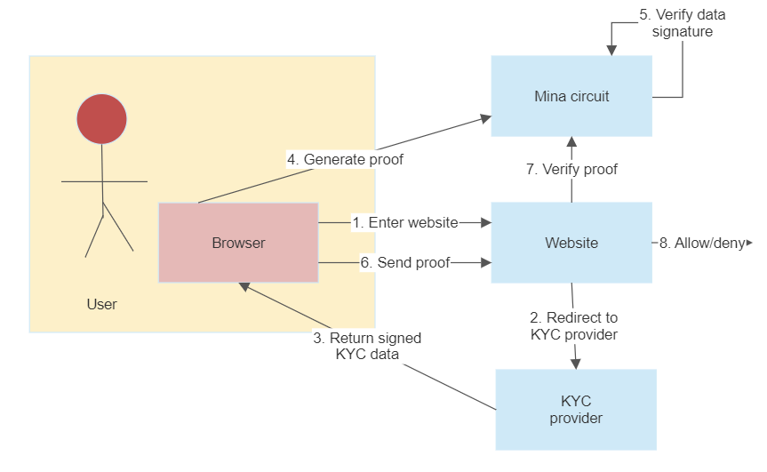

# ZK age check

This project is for enabling functionality to check a user's age in a website, with Zero Knowledge technology. The project utilizes o1js ZK library for generating ZK proofs and verifying them.

This project is aimed to be used as a template, a proof of concept and educational material. It is not meant for production use.

## Overview

The project showcases how user's age verification can be performed for restricted websites. If a suitable KYC provider is used, this project's code can be utilized almost as-is for a real product.

### Requirements for a KYC provider

To utilize a real KYC provider with this project, the provider has to meet the following requirements:

1. Have a simple UI that can be utilized through an _iframe_
1. Return data in a specific format
1. Sign the returned data using Schnorr signatures with specific elliptic curves

## Pieces of the puzzle

Below is a general overview of the process. Each piece is described in more detail.

### A website

A restricted website that prompts the user to verify their age.

Later in the process the website asks the Mina circuit to verify a provided proof.

### Mina blockchain

A ZK program is written in the [o1js framework](https://github.com/o1-labs/o1js). The circuit does the following:

1. Receive a signed message from a KYC provider. Verify the signature and generate a proof for the data
1. Verify a received proof, along with the claimed data

### KYC provider

This is a mocked KYC provider. It's a service which accepts an identity document (or, a mock of one), extracts requested data from it and sends back the data in a signed message.

### User's browser

Used as a coordinator in the process, and to eventually access the website.

## Overall process

The overall process follows the following steps:

1. User wants to open a website. The website requires all users to prove that they are above certain age.
1. The website opens a separate KYC provider to an _iframe_.
1. The KYC provider is mocked in this project. The provider has their own frontend which is shown in the iframe.
1. User performs steps required by the provider. In this project the steps are uploading your mock ID to the provider. The mock ID is a .txt file. The file should contain only the user's age and nothing else. (You can, for example, just save a file with text "50" in it and submit this).
1. The KYC provider extracts the age information from the submitted document, creates a JSON message of it and signs it with their private key. The signed message is sent back to the user's browser, out of the iframe.
1. The user's browser forwards this message to a Mina ZkProgram. The ZkProgram verifies that the signature is valid and provides a proof for it.
1. The user can then submit this proof for the restricted website for verification.
1. If the proof is valid, the user is displayed the restricted website

## Example deployment

The project is deployed at https://zk-agecheck.vercel.app/ .

## Developer instructions

The project utilizes Next.js. To run it locally:

1. Generate a keypair: `ts-node keygen.ts`
1. Add file _.env.local_ with content: `ORACLE_PRIVATE_KEY="GENERATED_PRIVATE_KEY"`
1. Change the public key in variable `ORACLE_PUBLIC_KEY` in _index.tsx_
1. Run `npm install`
1. Run `npm run dev` and open your browser at http://localhost:3000/

### Deployment

You can deploy the project to any hosting service. The only special configuration you need to set is the oracle private key.

## License

[Apache-2.0](LICENSE)
